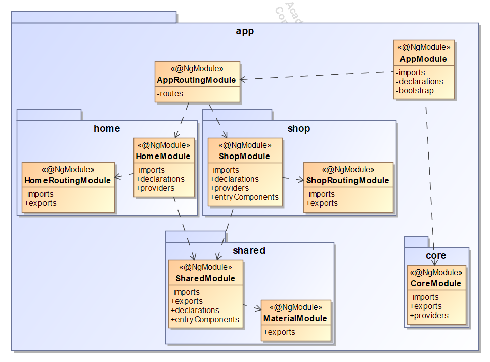

## [Máster en Ingeniería Web por la Universidad Politécnica de Madrid (miw-upm)](http://miw.etsisi.upm.es)
## Back-end con Tecnologías de Código Abierto: **SPRING**
> Proyecto TPV. Este proyecto es un apoyo docente de la asignatura. Es una aplicación completa realizada con un Front-end: Angular
 y dos Back-ends: Spring. El Back-end-user se desarrolla con programación síncrona y Postgresql. El Back-end-core se
 realiza con programación reactiva y MongoDB.

### Tecnologías necesarias
`Java` `Maven` `Spring-Boot` `Reactor` `Angular` `MondoDB` `JPA` `SQL` `GitHub` `Travis-CI` `Sonarcloud` `Better Code Hub` `Heroku`

### Estado del código
* Front-end-angular: [](https://github.com/miw-upm/betca-tpv-angular/actions)
[](https://sonarcloud.io/dashboard?id=es.upm.miw%3Abetca-tpv-angular)
* Back-end-user:[](https://github.com/miw-upm/betca-tpv-user/actions)
[](https://sonarcloud.io/dashboard?id=es.upm.miw%3Abetca-tpv-user)
* Back-end-core:[](https://github.com/miw-upm/betca-tpv-core/actions)
[](https://sonarcloud.io/dashboard?id=es.upm.miw%3Abetca-tpv-core) 

### :octocat: Repositorios
* [Front-end-angular](https://github.com/miw-upm/betca-tpv-angular)
* [Back-end-user](https://github.com/miw-upm/betca-tpv-user)
* [Back-end-core](https://github.com/miw-upm/betca-tpv-core)

### :gear: Instalación del proyecto
1. Clonar repositorios, **mediante consola**:
   * betca-tpv-angular
```sh
> cd <folder path>
> git clone https://github.com/miw-upm/betca-tpv-angular
> cd betca-tpv-angular
betca-tpv-angular> npm install
```
   * betca-tpv-user
```sh
> cd <folder path>
> git clone https://github.com/miw-upm/betca-tpv-user
```
   * betca-tpv-core
```sh
> cd <folder path>
> git clone https://github.com/miw-upm/betca-tpv-core
```   

2. Importar el proyecto `betca-tpv-angular` mediante **WebStorm** 
   * **Open**, y seleccionar la carpeta del proyecto.
3. Importar los proyectos `betca-tpv-user` & `betca-tpv-core` mediante **IntelliJ** 
   1. **Import Project**, y seleccionar la carpeta del proyecto.
   1. Marcar **Create Project from external model**, elegir **Maven**.
   1. **Next** … **Finish**.

4. Ejecución
   * Ejecución de test: se utiliza MongoDB embebido y H2 embebido
   * Ejecución en local:
      1. BBDD. Se debe tener arrancado el motor de MongoDB: `mongodb://localhost:27017/tpv`, y el motor de 
      Postgresql: `spring.datasource.url=jdbc:postgresql://localhost:5432/tpv`
      2. Spring. Ejecutar mediante linea de comando en ambos proyectos: `> mvn clean spring-boot:run`  
      3. Angular. Ejecutar mediante linea de comand: `> ng serve`  

## :book: Documentación del proyecto
> Este proyecto es la práctica TPV desarrollada de forma colaborativa por todos los alumnos. Se parte de la versión `core`,
ya implementada, y se pretende ampliar con un conjunto de mejoras. Un **T**erminal **P**unto de **V**enta
es un sistema informático que gestiona el proceso de venta mediante una interfaz accesible para los vendedores o compradores.
Permite la creación e impresión del recibo ticket o factura de venta —con los detalles de las referencias y precios— de los artículos vendidos,
actualiza los cambios en el nivel de existencias de mercancías (STOCK) en la base de datos... Además tiene la parte de venta on-line.

### Interfaz de Usuario
* [App TPV desplegada en Heroku](https://betca-tpv-angular.herokuapp.com)


### Arquitectura del Front-end: Angular


### Arquitectura del Back-end: Spring-User mediante Arquitectura por Capas

### Arquitectura del Front-end: Spring-Core mediante Arquitectura Hexagonal

